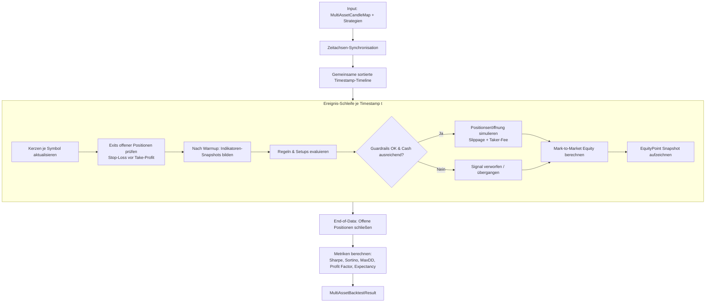

# Multi-Asset Backtest-Engine & Replay-Simulator (Task 02)

**Stand:** 2026-09-18 · **Modul:** `src/backtest/` · **API:** `/api/firm/backtest`
**Version:** `1.41.0` · **Status:** Implementiert

> **Fortschreibung (GAP-01, v1.51.0):** Diese Datei beschreibt die
> Engine-Basis (Event-Schleife, Portfolio, Legacy-Kostenmodell —
> `executionModel: "legacy"`, eingefroren). Neu dazu: Paper-Ausführung über
> den Paper-Fill-Simulator, Walk-Forward-Fenster, persistierte Runs und die
> CLI — siehe [BACKTESTING.md](BACKTESTING.md). Der synthetische
> `<5`-Kerzen-Fallback in Step 8 ist entfernt (fail-closed
> `DATA_UNAVAILABLE`).

---

## 1. Übersicht & Architekturziel

Die **Multi-Asset Backtest-Engine** ermöglicht das deterministische, ereignisgesteuerte Testen von Handelsstrategien (`RuleSpec`) und Research-Vorschlägen (`TradeSetupProposal`) über mehrere Instrumente und Zeitreihen hinweg.

### Kernprinzipien

1. **Reine Arithmetik & Determinismus:** Die gesamte Simulation ist mathematisch exakt, reproduzierbar (gleiche Eingabe $\Rightarrow$ identische Zahlen) und frei von Netzwerk-, LLM- oder unkontrollierten Zeitquellen.
2. **Kein Lookahead-Bias:** An jedem Zeitschritt $t$ haben Indikatoren und Strategien ausschließlich Zugriff auf bis zum Zeitpunkt $t$ geschlossene Kerzen.
3. **Gemeinsames Portfolio-Management:** Alle parallelen Instrumente teilen sich ein zentrales Portfolio mit gemeinsamem Cash, aggregiertem Eigenkapital und systemweiten Guardrails (`maxOpenPositions`, `maxPositionPct`, `maxRiskPerTrade`).
4. **Realistische Orderausführung:** Simulation von Slippage (Fixed BPS oder Spread-Relativ) und Gebühren (Maker / Taker) mit absolutem Stop-Loss-Vorrang bei Kerzenkollisionen.

---

## 2. Simulationsablauf & Event-Schleife



---

## 3. Ausführungs- & Kostenmodelle

### 3.1 Slippage-Modelle

Die Engine unterstützt drei konfigurierbare Slippage-Modi:

| Modell | Konfiguration | Berechnung |
|---|---|---|
| `none` | `slippageModel: "none"` | Kein Ausführungs-Slippage ($\Delta P = 0$). |
| `fixed` | `slippageModel: "fixed"` | Fester Aufschlag/Abschlag in Basispunkten (`fixedSlippageBps`, Default: 5 bp = 0.05 %). |
| `spread_relative` | `slippageModel: "spread_relative"` | Relativer Aufschlag basierend auf dem Spread des Instruments: $\text{Slippage} = \text{Spread} \times \text{spreadSlippageFactor}$. |

Einstiegskurse:
- **LONG:** $\text{FillPrice} = \text{Close} \times (1 + \frac{\text{Spread}}{2} + \text{SlippageRate})$
- **SHORT:** $\text{FillPrice} = \text{Close} \times (1 - \frac{\text{Spread}}{2} - \text{SlippageRate})$

### 3.2 Gebührenmodell

- **Einstieg (Market Order):** Taker-Gebühr auf das effektive Notional (`takerFee`, Default: 0.06 %).
- **Stop-Loss Ausstieg (Market Order):** Taker-Gebühr auf den Ausstiegswert.
- **Take-Profit Ausstieg (Limit Order):** Maker-Gebühr auf den Zielpreis (`makerFee`, Default: 0.02 %).

### 3.3 Stop-Loss / Take-Profit Kollisionsinvariante

Trifft eine extrem volatile Kerze innerhalb desselben Intervalls sowohl das Stop-Loss- als auch das Take-Profit-Niveau (z. B. $\text{Low} \le \text{SL}$ und $\text{High} \ge \text{TP}$), wird **ausnahmslos und zwingend der STOP-LOSS ausgeführt**. Dies verhindert Schönrechnungen in volatilen Marktphasen.

---

## 4. Berechnete Metriken & Kennzahlen

Die Kennzahlen werden nach Abschluss der Simulation aus den Trade-Logs und der kontinuierlichen Equity-Kurve abgeleitet:

| Kennzahl | Typ / Einheit | Beschreibung |
|---|---|---|
| `totalReturnPct` | Prozent (%) | Gesamtrendite bezogen auf das Startkapital. |
| `cagr` | Prozent (%) | Compound Annual Growth Rate über die Gesamtlaufzeit. |
| `sharpeRatio` | Dezimal | Annualisierte Sharpe Ratio ($r_f = 0$ oder konfigurierbar). |
| `sortinoRatio` | Dezimal | Annualisierte Sortino Ratio (Downside-Deviation). |
| `maxDrawdownPct` | Prozent (%) | Maximaler Peak-to-Trough-Verlust der Equity-Kurve. |
| `maxDrawdownDurationBars` | Integer | Dauer der längsten Drawdown-Phase in Kerzen. |
| `profitFactor` | Dezimal | Verhältnis von Bruttogewinnen zu Bruttoverlusten ($\frac{\sum \text{Gewinne}}{\|\sum \text{Verluste}\|}$). |
| `winRate` | Prozent (%) | Anteil profitabler Trades an der Gesamtanzahl. |
| `expectancy` | Kontowährung | Erwartungswert pro Trade: $(\text{WinRate} \times \text{AvgWin}) - (\text{LossRate} \times \text{AvgLoss})$. |
| `winLossRatio` | Dezimal | Verhältnis von durchschnittlichem Gewinn zu durchschnittlichem Verlust. |
| `maxConsecutiveWins/Losses`| Integer | Längste aufeinanderfolgende Gewinn- bzw. Verlustserien. |
| `exposureTimePct` | Prozent (%) | Zeitanteil mit mindestens einer aktiven Marktposition. |

---

## 5. API-Referenz & Verwendung

### 5.1 Programmatischer Aufruf in TypeScript

```ts
import { runMultiAssetBacktest, type BacktestStrategyItem } from "@/backtest";

const result = runMultiAssetBacktest({
  candlesBySymbol: new Map([
    ["BITUNIX:BTCUSDT", btcCandles],
    ["BITUNIX:ETHUSDT", ethCandles],
  ]),
  strategies: [
    { type: "rule", spec: btcRule, id: "R-BTC" },
    { type: "setup", setup: ethSetup, id: "S-ETH" },
  ],
  config: {
    initialCapital: 10_000,
    timeframe: "1h",
    maxOpenPositions: 5,
    maxRiskPerTrade: 0.02,
    maxPositionPct: 0.25,
    slippageModel: "fixed",
    fixedSlippageBps: 5,
  },
});

console.log(`Total Return: ${result.metrics.totalReturnPct}%`);
console.log(`Sharpe: ${result.metrics.sharpeRatio}`);
console.log(`Max Drawdown: ${result.metrics.maxDrawdownPct}%`);
```

### 5.2 REST-API: `POST /api/firm/backtest`

Erfordert die Berechtigung `firm.read` (bzw. Schreib-Guard bei mutierenden Triggern).

**Request-Payload:**
```json
{
  "symbols": ["BITUNIX:BTCUSDT", "BITUNIX:ETHUSDT"],
  "timeframe": "1h",
  "initialCapital": 10000,
  "maxOpenPositions": 5,
  "rules": [ ... ],
  "setups": [ ... ]
}
```

**Response (Auszug):**
```json
{
  "ok": true,
  "timeframe": "1h",
  "symbols": ["BITUNIX:BTCUSDT", "BITUNIX:ETHUSDT"],
  "strategiesCount": 2,
  "result": {
    "barsProcessed": 750,
    "metrics": {
      "startingEquity": 10000,
      "endingEquity": 11450.25,
      "totalReturnPct": 14.5,
      "sharpeRatio": 1.85,
      "sortinoRatio": 2.42,
      "maxDrawdownPct": 4.2,
      "profitFactor": 2.15,
      "winRate": 58.33,
      "totalTrades": 24
    },
    "equityCurve": [ ... ],
    "trades": [ ... ]
  }
}
```
