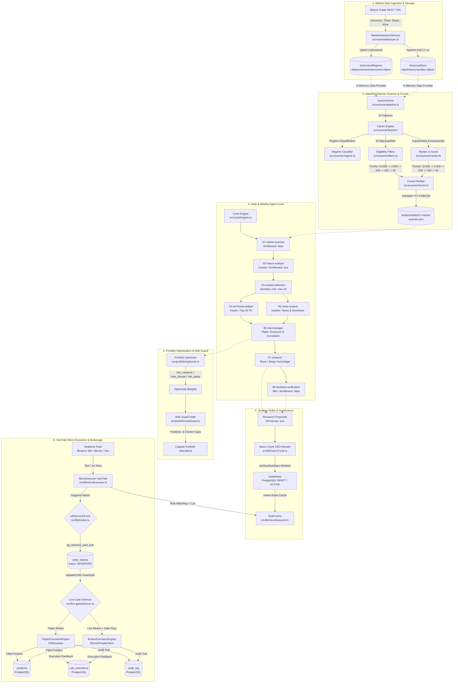
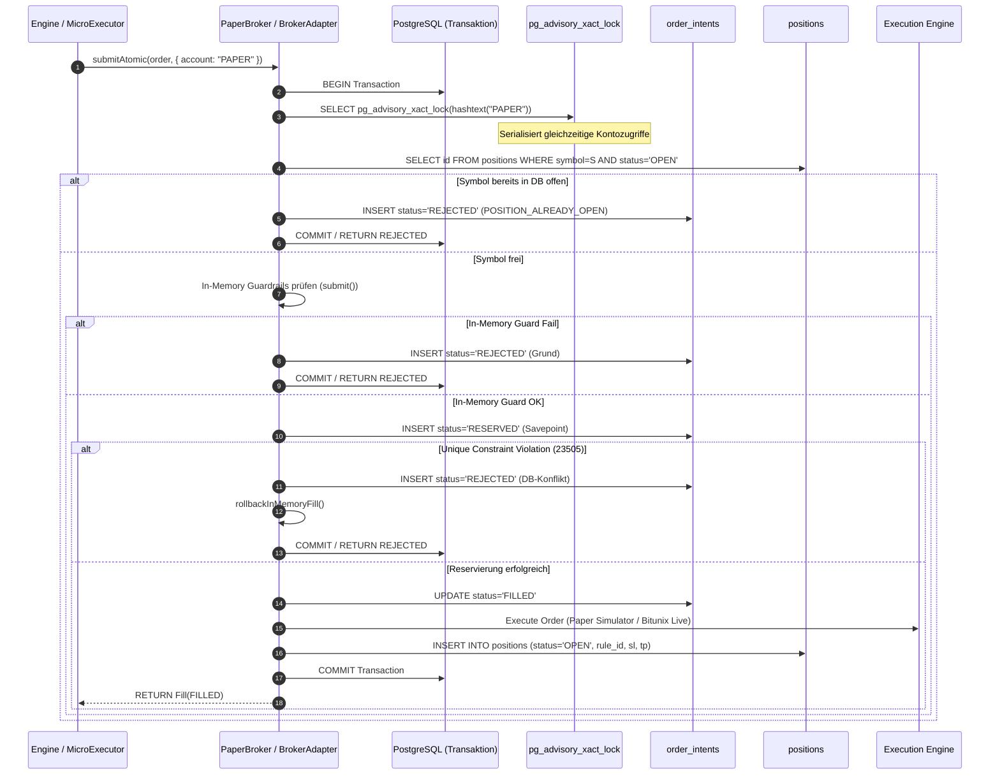

# Pipeline-Architektur & Ausführungskarte (v1.41.0)

> **Dokumenten-Status:** Master-Architekturkarte · **Stand:** 2026-09-18 · **Code-Version:** 1.41.0  
> **Verbindliche Referenz:** `docs/architecture/PIPELINE_MAP.md`

---

## 1. Systemphilosophie & Architekturprinzipien

Die Handelsarchitektur folgt fünf nicht verhandelbaren Kernprinzipien:

1. **LLM = Interpretation · Mathematik = Berechnung · Risk Engine = Autorität · Sicherheit im Code**  
   Sprachmodelle berechnen niemals numerische Werte (Preise, Notional, Positionsgrößen, VaR, Gewichte). Sie liefern ausschließlich strukturierte Lageeinschätzungen, die deterministisch validiert und numerisch berechnet werden.
2. **Kausale Entkopplung (Makro vs. Mikro)**  
   Strategische Intelligenz (LLM) und Ausführungsgeschwindigkeit (reines Skript) sind entkoppelt. Das LLM entscheidet langsam im Hintergrund (Makro-Zyklus: stündlich/täglich), der Micro-Executor handelt sofort pro Preis-Tick ohne LLM-Aufruf im Millisekundenbereich.
3. **Fail-Closed-Invariante**  
   Fehlende, anomale oder unsichere Daten führen **immer** zu „kein Trade“ (`HOLD` / `REJECTED`), niemals zu Default-Trades oder weichen Annahmen.
4. **Deterministischer Scanner ohne Netzwerk-I/O**  
   `src/scanner/` führt keinerlei Netzwerk- oder Datenbank-I/O aus. Alle Marktdaten werden vorab über den `MarketDataSyncService` synchronisiert und als lokale Datensätze bereitgestellt.
5. **Defense in Depth & Single State Registry**  
   Cross-Cutting-Singletons sind ausschließlich in `src/lib/stateRegistry.ts` typisiert registriert. Administrative Operationen und Order-Ausführungen sind durch RBAC (`requirePermission`), CSRF-Guards, Nonce-Challenges und den Live-Gate-Enforcer gesichert.

---

## 2. End-to-End Pipeline-Diagramm

---

## 3. Stufenweise Detail-Dokumentation

### Stufe 1: MarketDataSyncService (Ingestion & Normalisierung)

- **Dateien:**
  - `src/marketdata/sync.ts` (Orchestrierung & Sync-Schleife)
  - `src/marketdata/adapters/bitunix.ts` (Public-Client-Wrapper)
  - `src/marketdata/registerAdapters.ts` (Adapter-Registrierung mit Env-/Capability-Gate)
  - `src/marketdata/enrichment.ts` (Zweistufiges Ticker- & Orderbuch-Enrichment)
  - `src/marketdata/spread.ts` (Relative Spread-Berechnung aus Orderbuch)
  - `src/lib/marketdata/historicalStore.ts` (OHLCV-NDJSON-Speicher)
  - `src/lib/marketdata/types.ts` (Marktdaten-Typen)
- **Eingabe-Typen:**
  - `SyncOptions` / `ResolvedSyncOptions` (`timeframes`, `candleLimit`, `maxInstruments`, `concurrency`, `symbolAllowlist`, `fullRefresh`)
  - Bitunix Public API Payloads (`trading_pairs`, `tickers`, `depth`, `kline`)
- **Ausgabe-Typen:**
  - `SyncResult` (`venue`, `discovered`, `synced`, `skipped`, `tickersEnriched`, `orderbooksEnriched`, `candlesByTimeframe`, `failures`, `durationMs`)
  - `EnrichmentReport` (`enriched`, `unknown`, `skipped`)
- **Verwendete DB-Tabellen & Persistenzdateien:**
  - `data/universe/instruments.ndjson` (Instrument-Registry via `InstrumentRegistry`)
  - `data/history/candles.ndjson` (OHLCV-Reihen via `HistoricalStore`)
  - `data/market-data-errors.json` (Fehlermanifest via `resolveRuntimePath`)
- **Konfigurationsschlüssel & Env-Variablen:**
  - `BITUNIX_ENABLED` (Default: `false`, nur `"true"` aktiviert den Adapter)
  - `BITUNIX_TICKER_SYMBOLS_PER_REQUEST` (Default: `50`, Chunk-Größe für Bulk-Tickers)
  - `MARKET_SYNC_ENABLED` (Default: `true`)
  - `MARKET_SYNC_VENUES` (Default: `BITUNIX`)
  - `HISTORICAL_DATA_DIR` (Default: `data/history`)
  - `UNIVERSE_DATA_DIR` (Default: `data/universe`)
- **Feature-Flags:**
  - `BITUNIX_ENABLED=false` (Default: deaktiviert)
  - `BROKER_ALLOW_ENV_FALLBACK=false` (Default: in Produktion keine Env-Credentials)
- **Hooks & Events:**
  - CLI: `npm run market:sync -- --venue=BITUNIX`
  - Inkrementeller Sync: Prüft `lastBarBySeries` und überspringt unveränderte Reihen.
  - Fehlerklassifikation: `classifyMarketDataError` emittiert maschinenlesbare Gründe (`RATE_LIMITED`, `SCHEMA_MISMATCH`, etc.).

---

### Stufe 2: Deterministischer Scanner & Eignungsfilter

- **Dateien:**
  - `src/scanner/pipeline.ts` (`scanUniverse`)
  - `src/scanner/service.ts` (`ScannerService`)
  - `src/scanner/filters.ts` (10 Eignungsfilter)
  - `src/scanner/regime.ts` (`classifyRegime`)
  - `src/scanner/factors/*` (15 Faktoren: `liquidity`, `spread`, `atr`, `volatility`, `momentum`, `trend`, `volumeRatio`, `rsi`, `drawdown`, `correlation`, `news`, `funding`, `openInterest`, `executionCost`, `crossSectionalMomentum` — letzter als Diagnose ohne Score-Gewicht, v1.63.0)
  - `src/scanner/cache.ts` (`FactorCache`)
  - `src/scanner/warmup.ts` (`assessDataReadiness`, `requiredWarmupCandles`)
- **Eingabe-Typen:**
  - `ScanOptions` (`instruments: MarketInstrument[]`, `data: ScanDataProvider`, `asOf: number | Date | string`, `config?: ScannerConfig`)
  - `FactorInput` (`instrument`, `candles`, `benchmarkCandles`, `derivatives`, `news`, `asOf`, `config`)
- **Ausgabe-Typen:**
  - `ScanResult` (`asOf`, `config`, `funnel: FunnelResult`, `readiness: ScannerReadiness`, `scores: InstrumentScore[]`, `byId: Map<string, InstrumentScore>`, `rejections: FilterRejection[]`)
  - `FactorValue` (`raw`, `normalized`, `available`, `detail`)
- **Verwendete DB-Tabellen & Persistenzdateien:**
  - Keine DB-Tabellen (strikte Import- und I/O-Freiheit)
  - Schreibt Tagesabzüge nach `artifacts/<YYYY-MM-DD>/universe.json` via `writeDailyUniverseArtifact`
- **Konfigurationsschlüssel & Env-Variablen:**
  - `src/scanner/scanner.config.json` (Gewichte, Regimeschwellen, Filtergrenzen)
  - `SCANNER_CONFIG_FILE` (Override-Pfad)
  - `SCANNER_ARTIFACTS_DIR` (Default: `artifacts`)
- **Feature-Flags:**
  - `SCANNER_CONFIG_FILE` (Default: intern `version: 1`)
- **Hooks & Events:**
  - CLI: `npm run scan` (schreibt Artefakte) bzw. `npm run scan -- --dry`
  - HTTP: `GET /api/universe/daily`, `GET /api/universe/weekly`, `GET /api/universe/score/{instrumentId}`

---

### Stufe 3: Market Ranker & Trichter (Funnel)

- **Dateien:**
  - `src/scanner/ranker.ts` (`scoreFromFactors`, `rankByScore`)
  - `src/scanner/funnel.ts` (`buildFunnel`)
  - `src/scanner/types.ts` (`FunnelResult`, `FunnelStageResult`, `InstrumentScore`)
- **Eingabe-Typen:**
  - `eligibleScores: InstrumentScore[]`, Gesamtzahl `universeSize: number`, `FunnelConfig`
- **Ausgabe-Typen:**
  - `FunnelResult` mit Stufen:
    - `universe`: Rohuniversum (~10.000)
    - `eligible`: Nach Eignungsfiltern (max. 2.000)
    - `interesting`: Nach Mindest-Score (max. 500)
    - `daily`: Tagesfokus (max. 100)
    - `deep`: Tiefenanalyse für Agenten (max. 20–40)
- **Verwendete DB-Tabellen & Persistenzdateien:**
  - Keine DB-Tabellen; Output wandert in `artifacts/<YYYY-MM-DD>/daily/01-market-scanner.json`.
- **Konfigurationsschlüssel & Env-Variablen:**
  - Konfiguriert über `scanner.config.json` (`funnel.eligible.maxCount = 2000`, `funnel.interesting.maxCount = 500`, `funnel.daily.maxCount = 100`, `funnel.deep.maxCount = 40`).
- **Feature-Flags:**
  - Keine (deterministische Arithmetik).
- **Hooks & Events:**
  - Trichter-Ausgabe dient als direkter Input für den Agenten-Zyklus (`01-market-scanner`).

---

### Stufe 4: Daily & Weekly Agent Cycles

- **Dateien:**
  - `src/cycle/engine.ts` (`executeCycle`, `createGuardedAgentPort`)
  - `src/cycle/daily.ts` (`createDailySteps`, `DAILY_CYCLE_SCHEDULE`)
  - `src/cycle/weekly.ts` (`executeWeeklyReview`, `classifyWeekly`)
  - `src/cycle/service.ts` (`CycleService`)
  - `src/cycle/artifacts.ts` (`writeCycleArtifact`, `pruneArtifacts`)
  - `src/cycle/types.ts` (`StepDefinition`, `CycleRunRecord`, `StepRunRecord`, `CyclePorts`)
- **Eingabe-Typen:**
  - `CycleExecutionOptions` (`cycleId`, `type: "daily" | "weekly"`, `date`, `steps`, `ports`, `clock`, `initialInput`)
- **Ausgabe-Typen:**
  - `CycleRunRecord` (`id`, `type`, `date`, `status: "RUNNING" | "COMPLETED" | "FAILED"`, `steps: StepRunRecord[]`, `escalations: ModelEscalationRequest[]`, `error?`)
  - `DailyCycleArtifacts` & `WeeklyReview`
- **Verwendete DB-Tabellen & Persistenzdateien:**
  - PostgreSQL: `audit_log` (Events: `CYCLE_STARTED`, `CYCLE_STEP_STARTED`, `CYCLE_STEP_COMPLETED`, `CYCLE_STEP_FAILED`, `CYCLE_FAILED`, `CYCLE_COMPLETED`, `MODEL_ESCALATION_REQUEST`)
  - Dateisystem: `artifacts/<YYYY-MM-DD>/daily/*`, `artifacts/<YYYY-Www>/weekly/*`, `artifacts/index.json`
- **Konfigurationsschlüssel & Env-Variablen:**
  - `CYCLE_ARTIFACTS_DIR` (Default: `artifacts`)
  - `CYCLE_RETENTION_DAYS` (Default: `30`)
  - `CYCLE_RETENTION_WEEKS` (Default: `12`)
- **Feature-Flags:**
  - Kein Feature-Flag für die Engine; Schritte schalten LLMs über `llmAllowed: boolean` hart ab.
- **Hooks & Events:**
  - Retry-Policy je Schritt (`maxAttempts`, `backoffMs`, `backoffMultiplier`).
  - Eskalations-Event `MODEL_ESCALATION_REQUEST` bei komplexer Marktlage.
  - HTTP-Routen: `GET /api/analysis/daily/latest`, `GET /api/analysis/daily/[date]`, `GET /api/analysis/weekly/latest`, `GET /api/analysis/runs`.

---

### Stufe 5: Agent Analysis (Macro, TA, News)

- **Dateien:**
  - `src/cycle/steps/macroStep.ts` (Cassini / Makro-Analyse)
  - `src/cycle/steps/selectionStep.ts` (Kandidatenauswahl, hart geklemmt auf ≤ 40)
  - `src/cycle/steps/technicalStep.ts` (Kepler / Multi-Timeframe-TA 15m/1h/4h)
  - `src/cycle/steps/newsStep.ts` (Hubble / News & Sentiment)
  - `src/lib/analysts.ts` (Standalone Analysten-Routinen: `runTechnicalAnalyst`, `runMacroAnalyst`, `runNewsAnalyst`, `runPennyTeam`)
  - `src/lib/llmProvider.ts` (`chatLlm`, `createLlmClient`)
  - `src/lib/ollama.ts` (`localReason`)
  - `src/routing/router.ts` (`ModelRouter`)
- **Eingabe-Typen:**
  - `MacroStepInput` (Snapshot der 7 Pflicht-Assets: BTC, ETH, DXY, SPX, Nasdaq, Gold, Bonds)
  - `SelectionStepInput` (Daily/Deep Trichterlisten)
  - `TechnicalStepInput` & `NewsStepInput` (Max. 40 Instrumente via `assertShortlistLimit`)
  - `wrapUntrustedData()` Container für externe News/Marktdaten.
- **Ausgabe-Typen:**
  - `MacroStepOutput` (`regime: "RISK_ON" | "RISK_OFF" | "MIXED"`, `volatility: "LOW" | "NORMAL" | "HIGH" | "EXTREME"`, `thesis`)
  - `SelectionStepOutput` (`dailyCandidates: string[]` ≤ 40)
  - `TechnicalStepOutput` (`analyses: TechnicalAnalysisEntry[]`)
  - `NewsStepOutput` (`sentiments: NewsSentimentEntry[]`, `systemicRisk`)
- **Verwendete DB-Tabellen & Persistenzdateien:**
  - PostgreSQL: `agents` (Liest `system_prompt`, `model`, `version`)
  - PostgreSQL: `agent_messages` (Persistiert Analysen mit Actor-Snapshots, Latency, Kosten & Trace)
  - PostgreSQL: `audit_log` (Ereignisse und Validierungsfehler)
- **Konfigurationsschlüssel & Env-Variablen:**
  - `MODEL_MACRO`, `MODEL_TECHNICAL`, `MODEL_NEWS`, `MODEL_SCOUT`, `MODEL_DILIGENCE`
  - `LLM_PROVIDER` (Default: `ollama`, Optionen: `openai`, `gemini`, `anthropic`)
  - `LLM_FALLBACK_PROVIDERS` (Komma-separierte Fallback-Kette)
  - `OLLAMA_BASE_URL` (Default: `http://127.0.0.1:11434`)
  - `MAX_SHORTLIST_LIMIT = 40` (Harte Code-Schranke)
- **Feature-Flags:**
  - Provider-Fallback-Kette transparent aktiv.
- **Hooks & Events:**
  - `wrapUntrustedData`: Kapselt Fremddaten in `type: "untrusted_external_data"` gegen Prompt-Injections.
  - Schema-Validatoren: `validateMacroOutput`, `validateSelectionOutput`, `validateTechnicalOutput`, `validateNewsOutput`.

---

### Stufe 6: Research & Strategy Generation

- **Dateien:**
  - `src/cycle/steps/researchStep.ts` (Rhea / Setup-Vorschläge)
  - `src/cycle/steps/backtestStep.ts` (Milo / Multi-Asset Backtest-Verifikation via `src/backtest`)
  - `src/backtest/engine.ts`, `src/backtest/portfolio.ts`, `src/backtest/simulator.ts`, `src/backtest/metrics.ts`
  - `src/lib/macroCycle.ts` (`runMacroCycle`, CEO/Research-Regel-Zyklus)
  - `src/lib/ruleEngine.ts` (`sanitizeRuleSpec`, `ruleSignature`, `RULE_CEILINGS`)
  - `src/lib/ruleService.ts` (`upsertRuleSpec`, `activateRule`, `listRules`)
- **Eingabe-Typen:**
  - `ResearchStepInput` (`approvedCandidates: string[]`)
  - `BacktestStepInput` (`setups: TradeSetupProposal[]`)
  - `RuleSpecInput` (`symbol`, `condition`, `action`, `window`, `rationale`)
- **Ausgabe-Typen:**
  - `ResearchStepOutput` (`setups: TradeSetupProposal[]`, `isProposal: true`, `disclaimer: "PROPOSAL_ONLY_NO_ORDERS_PLACED"`)
  - `BacktestStepOutput` (`verifiedSetups: VerifiedSetupResult[]`, `metrics: { maxDrawdownPct, profitFactor, sharpeRatio, sortinoRatio, regimeRobustness }`)
  - `RuleSpec` (Sanitized & Geklemmt)
- **Verwendete DB-Tabellen & Persistenzdateien:**
  - PostgreSQL: `trade_rules` (Spalten: `rule_key`, `version`, `status`, `condition`, `action`, `window`, `signature`, `source_role`, `source_mode`)
  - PostgreSQL: `rule_backtests` (Backtest-Historie mit `pnl`, `profit_factor`, `max_drawdown_pct`, `detail`)
  - PostgreSQL: `proposals` (Vorschläge für den Freigabe-Workflow)
  - Dateisystem: `artifacts/<YYYY-MM-DD>/daily/07-research.json` und `08-backtest-verification.json`
- **Konfigurationsschlüssel & Env-Variablen:**
  - `MACRO_CYCLE_INTERVAL_MIN` (Default: `60`)
  - `REQUIRE_HUMAN_APPROVAL` (Default: `true`)
  - `MODEL_RESEARCH`, `MODEL_CEO`
- **Feature-Flags:**
  - `REQUIRE_HUMAN_APPROVAL=true` erzwingt Status `DRAFT` statt direkter Aktivierung.
- **Hooks & Events:**
  - Partielle Unique-Indizes auf `trade_rules` verhindern parallele Doppelaktivierungen.
  - `ruleAudit()` schreibt Revisionsspuren bei jeder Statusmutation.

---

### Stufe 7: Risk Manager & Guardrails

- **Dateien:**
  - `src/cycle/steps/riskStep.ts` (Rigel / Kandidaten-Freigabe)
  - `src/lib/riskGuard.ts` (`validateOrder`, `killSwitch`, `RISK_LIMITS`, `LIMIT_CEILINGS`)
  - `src/lib/adaptiveRisk.ts` (`getAdaptiveRiskFactor`, `evaluateMarketRegime`)
  - `src/lib/riskConfigService.ts` (Laden von `risk_config`)
- **Eingabe-Typen:**
  - `RiskStepInput` (TA-Analysen + News-Sentiment + Korrelationsdaten)
  - `OrderValidationParams` (`notional`, `equity`, `openPositions`, `side`, `leverage`, `hasStopLoss`, `symbol`)
- **Ausgabe-Typen:**
  - `RiskStepOutput` (`approvedCandidates: string[]`, `rejectedCandidates: { symbol, reason }[]`, `clusterWarnings`)
  - `ValidationResult` (`allowed: boolean`, `reason?: string`, `adjustedSize?: number`)
- **Verwendete DB-Tabellen & Persistenzdateien:**
  - PostgreSQL: `risk_config` (Informative Anzeige, wirksame Limits im Code)
  - PostgreSQL: `kill_switches` (Persistenter Not-Halt)
  - PostgreSQL: `audit_log` (Events: `RISK_REJECTED`, `KILL_SWITCH_ARMED`)
  - Dateisystem: `data/live-gate/kill-switch.json` (Unabhängige Failsafe-Sperrdatei)
- **Konfigurationsschlüssel & Env-Variablen:**
  - `STARTING_EQUITY` (Default: `10000`)
  - `FIRM_MAX_RISK_PER_TRADE` (Default: `0.02` = 2 %)
  - `FIRM_MAX_OPEN_POSITIONS` (Default: `5`)
  - `FIRM_MAX_DRAWDOWN_STOP` (Default: `0.10` = 10 %)
  - `FIRM_DAILY_LOSS_LIMIT` (Default: `0.05` = 5 %)
- **Feature-Flags:**
  - `killSwitch.isArmed()` (Prozessweiter In-Memory- und Disk-Circuit-Breaker)
- **Hooks & Events:**
  - Auto-Kill bei Drawdown- oder Tagesverlust-Überschreitung.
  - Hysterese bei Volatilitätsregimewechseln (Eskalation sofort, De-Eskalation verzögert).

---

### Stufe 8: Portfolio Engine & Optimizer

- **Dateien:**
  - `src/portfolio/optimize.ts` (`optimizeWithGuard`, `optimizeWeights`)
  - `src/portfolio/riskGuard.ts` (`guardPortfolioAllocations`, `enforcePositionLimits`, `enforceCorrelationLimits`)
  - `src/portfolio/metrics.ts` (`computeSeriesMetrics`, `sharpeRatio`, `sortinoRatio`, `maxDrawdown`)
  - `src/portfolio/correlation.ts` (`computeCorrelationMatrix`, `clusterAssets`)
  - `src/portfolio/context.ts` (`getAnalysisContext`)
  - `src/portfolio/types.ts` (`OptimizationResult`, `PortfolioGuardReport`)
- **Eingabe-Typen:**
  - `OptimizationRequest` (`series`, `mode: "min_variance" | "max_sharpe" | "risk_parity"`, `covariance`, `bounds`, `guard`)
- **Ausgabe-Typen:**
  - `OptimizationResult` (`weights: number[]`, `diagnostics: OptimizationDiagnostics`)
  - `PortfolioGuardReport` (`chain`, `rejected: boolean`, `adjusted: boolean`, `reasons: string[]`, `decisions`)
- **Verwendete DB-Tabellen & Persistenzdateien:**
  - Keine DB-Tabellen (reine Rechenbibliothek)
  - Optionales Dateiaudit: `data/portfolio/audit-log.ndjson` (via `PORTFOLIO_AUDIT_DIR`)
- **Konfigurationsschlüssel & Env-Variablen:**
  - `PORTFOLIO_CONFIG_VERSION = 1`
  - `PORTFOLIO_AUDIT_DIR` (Default: `data/portfolio`)
  - `PORTFOLIO_AUDIT` (Default: `0`)
- **Feature-Flags:**
  - `allowShortSelling` (Default: `false` = Long-Only)
- **Hooks & Events:**
  - HTTP-Routen: `POST /api/portfolio/metrics`, `POST /api/portfolio/correlation`, `POST /api/portfolio/optimize`.
  - `getAnalysisContext`: Schnittstelle für LLMs mit Leitplanken (`llmMay` / `llmMustNot`).

---

### Stufe 9: Approval Layer & Governance

- **Dateien:**
  - `src/app/api/firm/proposals/[id]/approve/route.ts` (Proposal-Freigabe)
  - `src/app/api/firm/rules/[id]/route.ts` (Regel-Lifecycle: `activate`, `pause`, `archive`, `rollback`, `reject`)
  - `src/auth/resolve.ts` (`requirePermission`, `resolveAuth`)
  - `src/auth/permissions.ts` (`ROLE_PERMISSIONS`, `RULE_ACTION_PERMISSIONS`)
  - `src/live-gate/service.ts` & `src/live-gate/enforcer.ts` (Live-Gate-Übergänge & Human-Gate)
- **Eingabe-Typen:**
  - Proposal-ID, Lifecycle-Action (`activate`, `pause`, `archive`, `rollback`, `reject`), Transition-Payload (`venue`, `to`, `reason`, `confirm`, `approvedBy`)
- **Ausgabe-Typen:**
  - Mutation-Status, erzeugte Orders/Fills, geänderte `trade_rules`-Zeile, `GateTransitionResult`
- **Verwendete DB-Tabellen & Persistenzdateien:**
  - PostgreSQL: `proposals` (Statuswechsel `PENDING` → `APPROVED` / `REJECTED`)
  - PostgreSQL: `trade_rules` (Statuswechsel `DRAFT` → `ACTIVE` → `SUPERSEDED` / `PAUSED` / `ARCHIVED`)
  - PostgreSQL: `audit_log` (Events: `PROPOSAL_APPROVED`, `RULE_ACTIVATED`, `RULE_REJECTED`, etc.)
  - Dateisystem: `data/live-gate/venue-{VENUE}.json`, `data/live-gate/audit-log.ndjson`
- **Konfigurationsschlüssel & Env-Variablen:**
  - `FIRM_ADMIN_TOKEN` (Admin-Rolle)
  - `FIRM_OPERATOR_TOKEN` (Operator-Rolle)
  - `REQUIRE_HUMAN_APPROVAL` (Default: `true`)
  - `LIVE_GATE_COOLDOWN_MS` (Default: `86400000` = 24 h)
  - `LIVE_GATE_FOUR_EYES` (Default: `false`)
- **Feature-Flags:**
  - RBAC aktiv; ohne Token Dev-Modus `local-open` (in Produktion verboten).
- **Hooks & Events:**
  - SEC-06 Governance: `strategy.rules.activate`, `.rollback`, `.archive` verlangen Admin-Rechte.
  - Live-Gate Übergang 7 (`LIVE_PENDING` → `HUMAN_APPROVED`) erzwingt 24h Cooldown und optionale 4-Augen-Validierung.

---

### Stufe 10: Rule Engine & Micro-Executor (Hot-Path)

- **Dateien:**
  - `src/lib/ruleEngine.ts` (`compileRuleSpec`, `matchRule`, `evaluateRule`, `RuleSnapshot`)
  - `src/lib/ruleService.ts` (`listActiveRules`, `recordRuleExecution`)
  - `src/lib/microExecutor.ts` (`MicroExecutor`, `RuleCache`, `RollingTimeframeSeries`)
  - `scripts/micro-executor.ts` (Standalone Runner `npm run micro`, Health-Port 3380)
- **Eingabe-Typen:**
  - `PriceTick` (`symbol`, `price`, `volume`, `timestamp`) / `MarketCandle`
  - `RuleCache` mit im RAM vorkompilierten `CompiledRule`-Evaluatoren
- **Ausgabe-Typen:**
  - `RuleMatchResult` (`matched: boolean`, `reason?: string`, `rule?: CompiledRule`)
  - `RuleExecutionRecord` (Persistiertes Feedback)
- **Verwendete DB-Tabellen & Persistenzdateien:**
  - PostgreSQL: `trade_rules` (Liest `WHERE status = 'ACTIVE'`)
  - PostgreSQL: `rule_executions` (Schreibt `status: 'TRIGGERED' | 'BLOCKED' | 'ERROR'`, `latency_micros`, `snapshot`, `evaluated`, `fill`)
  - PostgreSQL: `positions` (Verknüpfung via `rule_id`)
- **Konfigurationsschlüssel & Env-Variablen:**
  - `MICRO_RULE_REFRESH_MS` (Default: `30000` = 30 s Cache-Poll)
  - `MICRO_FEED_TYPE` (`binance` | `simulator` | `sequence`)
  - `MICRO_SYMBOLS` (Default: `BTCUSDT,ETHUSDT`)
  - `MICRO_HEALTH_PORT` (Default: `3380`)
- **Feature-Flags:**
  - Autonomer Micro-Executor-Prozess.
- **Hooks & Events:**
  - Latenz-Tracking: `latencyMicros` misst die reine Evaluierungszeit (< 1 µs pro Regel).
  - Feedback-Loop: `rule_executions` und `positions.realized_pnl` fließen in den nächsten Makro-Cycle-Prompt ein.

---

### Stufe 11: Paper- & Live-Execution Layer

- **Dateien:**
  - `src/contracts/broker.ts` (`BrokerAdapter`, `BrokerOrderRequest`, `BrokerOrderResult`, `BrokerAccount`)
  - `src/brokers/factory.ts` (`getBroker`, `createAdapter`)
  - `src/brokers/paper.ts` (`PaperBrokerAdapter`)
  - `src/lib/broker.ts` (`PaperBroker`, `withAccountLock`, `submitAtomic`, `OrderIntentConflictError`)
  - `src/brokers/bitunix/adapter.ts` (`BitunixBrokerAdapter`)
  - `src/brokers/bitunix/execution.ts` (`PaperExecutionEngine`, `BrokerExecutionEngine`, `ExecutionPort`)
  - `src/brokers/bitunix/orders.ts` (`serializePlaceOrder`, `clientOrderIdFor`)
  - `src/brokers/bitunix/privateClient.ts` (`BitunixPrivateClient`)
  - `src/live-gate/enforcer.ts` (`assertLiveOrderAllowed`, `evaluateLiveOrder`)
- **Eingabe-Typen:**
  - `BrokerOrderRequest` (`symbol`, `side: "LONG" | "SHORT"`, `qty`, `limitPrice?`, `stopLoss?`, `takeProfit?`, `riskNotional`)
- **Ausgabe-Typen:**
  - `BrokerOrderResult` (`orderId`, `symbol`, `side`, `qty`, `filledQty`, `fillPrice`, `status: "NEW" | "FILLED" | "PARTIALLY_FILLED" | "REJECTED" | "CANCELED" | "UNKNOWN"`, `reason?`)
  - `Fill` / `ExecutedFill`
- **Verwendete DB-Tabellen & Persistenzdateien:**
  - PostgreSQL: `order_intents` (Atomare Reservierung via `status = 'RESERVED'`)
  - PostgreSQL: `positions` (Persistierte Positionen mit `entry_price`, `sl`, `tp`, `rule_id`, `status: 'OPEN' | 'CLOSED'`)
  - PostgreSQL: `equity_snapshots` (Snapshots für Equity-Kurve & PnL-Tracking)
  - PostgreSQL: `audit_log` (Event: `BROKER_FACTORY`, `ORDER_PLACED`, `ORDER_FILLED`, etc.)
- **Konfigurationsschlüssel & Env-Variablen:**
  - `BITUNIX_ENABLED` (Default: `false`)
  - `BITUNIX_LIVE_ENABLED` (Default: `false`)
  - `LIVE_TRADING_ENABLED` (Default: `false`)
  - `REQUIRE_HUMAN_APPROVAL` (Default: `true`)
  - `SECRET_STORE_KEY` (AES-256-GCM Master-Key für Control-Plane-Credentials)
- **Feature-Flags:**
  - Live-Trading ist 4-fach gegated (`LIVE_TRADING_ENABLED`, `BITUNIX_LIVE_ENABLED`, `REQUIRE_HUMAN_APPROVAL=false`, Live-Gate-Zustand `LIVE_ENABLED`). Fehlt eine Bedingung, schlägt die Order mit `LiveTradingGateError` fehl.
- **Hooks & Events:**
  - `withAccountLock`: Exklusiver `pg_advisory_xact_lock` je Konto.
  - H3 Reconciliation: `reconcile(orderId)` gleicht asynchron Fills und Trades mit der Bitunix-Private-API ab.
  - H7 Notfall-Pfad: `cancelAllOpenOrders()`, `closeAllPositions()`, `verifyFlat()`.

---

## 4. Persistenz von Candle- und Ticker-Daten

### 4.1 Ticker- und Instrumenten-Persistenz (`InstrumentRegistry`)

- **Speicherort:** `data/universe/instruments.ndjson` (oder konfiguriert über `UNIVERSE_DATA_DIR`).
- **Format:** NDJSON (eine Zeile pro Instrument, JSON-Objekt).
- **Enrichment-Felder:**
  - `volume24h`: Aus Bitunix Bulk-Tickern (`GET /tickers`).
  - `spread`: Aus Bitunix Orderbuch (`GET /depth`, limit=5) berechnet als `(ask - bid) / mid`.
  - `lastSeen`: ISO-8601-UTC-Zeitstempel des letzten erfolgreichen Syncs.
  - `makerFee` / `takerFee`: VIP0-Standardwerte (0.02 % / 0.06 %).
  - `minQuantity`, `quantityStep`, `priceStep`.
- **Deduplizierung & Mutation:** Deterministischer Upsert über `InstrumentRegistry.upsert()`. Datei wird atomar über `.tmp` + `renameSync` mit Mode `0600` geschrieben.

### 4.2 Kerzen-Persistenz (`HistoricalStore`)

- **Speicherort:** `data/history/candles.ndjson` (oder konfiguriert über `HISTORICAL_DATA_DIR`).
- **Schema-Version:** **v2** (jede Zeile enthält `v: 2` und ein verpflichtendes `timeframe`-Feld).
- **Zulässige Timeframes (`SupportedTimeframe`):**
  `1m`, `3m`, `5m`, `15m`, `30m`, `1h`, `2h`, `4h`, `1d`, `5d`.
- **Logischer Primärschlüssel:** `instrumentId + timeframe + ts`. Bei Kollision gewinnt der Datensatz mit dem jüngeren `fetchedAt`.
- **Retention & Kompaktierung:**
  - `maxBarsPerSeries`: Standard **5.000 Kerzen** pro `(instrumentId, timeframe)`-Paar.
  - Beim Batch-Append (`appendSeries`) werden ältere Kerzen jenseits der 5.000er-Grenze automatisch abgeschnitten (`compact()`).
- **Schreib- und Lese-Garantien:**
  - Schreibvorgänge: Streambasiertes Laden, In-Memory-Indexierung, Kompaktierung und **ein** atomarer Schreibvorgang via `.tmp` + `renameSync`.
  - Lesevorgänge: Pufferbasiertes Streaming (`readLinesSync`, Chunk-Größe 1 MB) verhindert Node-OOM bei großen Dateien. `query()` erzwingt `instrumentId` und `timeframe`.

---

## 5. Order-Lifecycle, Atomare Reservierung & Bitunix-Ausführung

### 5.1 Ablauf der atomaren Order-Reservierung (`submitAtomic`)

Um Race Conditions zwischen parallelen Node.js-Workern und dem Micro-Executor auszuschließen (Befund H2), läuft die Order-Erstellung in einer einzigen PostgreSQL-Transaktion ab:

### 5.2 Bitunix Order-Typen und Serialisierung

Der Bitunix-Adapter (`src/brokers/bitunix/orders.ts`) mappt standardisierte `BrokerOrderRequest`-Objekte auf die Bitunix Futures REST API (`POST /api/v1/futures/trade/place_order`):

- **Unterstützte Order-Typen:**
  - `MARKET`: Standard für sofortige Ausführung (wenn `limitPrice` ungesetzt oder 0).
  - `LIMIT`: Limit-Order mit `effect: "GTC"` (Good 'Til Canceled), wenn `limitPrice > 0`.
- **Trade-Richtung:** `tradeSide: "OPEN"`, `side: "BUY"` (für LONG) bzw. `side: "SELL"` (für SHORT).
- **Position Protection (`stopAtVenue = true`):**
  - Stop-Loss: `slPrice: String(req.stopLoss)`, `slStopType: "LAST_PRICE"`, `slOrderType: "MARKET"`.
  - Take-Profit: `tpPrice: String(req.takeProfit)`, `tpStopType: "LAST_PRICE"`, `tpOrderType: "MARKET"`.
  - **B1 SL/TP-Geometrie-Validierung:** Bei LONG muss `stopLoss < entry` und `takeProfit > entry` gelten; bei SHORT muss `stopLoss > entry` und `takeProfit < entry` gelten. Ungültige Geometrien werden vor dem Senden mit `OrderSerializationError` abgewiesen.
- **H4 Idempotenz & Client-Order-ID:**
  - Format: `ATF-<sha256-digest-20-chars>`.
  - Deterministisch generiert aus Symbol, Seite, Menge, Limit-Preis, SL, TP und Intent-Timestamp.
  - Bei Netzwerk-Timeouts (`BitunixAmbiguousError`) wird **nicht** blind wiederholt; stattdessen fragt der Adapter zuerst per `clientId` den Status ab (`getOrderByClientId`).

---

## 6. Agenten-Aufruf, Prompt-Versionierung & Output-Parsing

### 6.1 Prompt-Speicherung & Optimistische Sperre (`agents.version`)

- **Agenten-Tabelle (`agents`):** Speichert Rollen (`CEO`, `RESEARCH`, `TECHNICAL_ANALYST`, etc.), Ollama/Cloud-Modelltags (`model`), System-Prompts (`system_prompt`) und die Versionsnummer (`version: integer`).
- **W2 Optimistic Locking:** Bei jeder Aktualisierung des System-Prompts im Workshop/Editor wird `version = version + 1` erzwungen. Sendet der Aufrufer eine veraltete `expectedVersion`, antwortet die API mit `409 Conflict`, um versehentliches Überschreiben (Lost Updates) zu verhindern.

### 6.2 Output-Parsing & Confidence-Verarbeitung

- **Strukturierte JSON-Erzwingung:** `localReason` und `chatLlm` fordern JSON-Ausgaben über Schema-Parameter an.
- **Parsing:** `extractJsonObject()` extrahiert das JSON-Objekt aus dem Antworttext (auch bei umschließendem Markdown).
- **Schema-Validierung:** Jeder Schritt validiert den geparsten Payload mit dedizierten Validierungsfunktionen (z. B. `validateMacroOutput`, `validateResearchOutput`). Schlägt die Validierung fehl oder enthält die Antwort unerlaubte Felder, greift ein **deterministischer Fallback**.
- **Confidence-Normalisierung:** Das Feld `confidence` wird über `finiteConfidence(val, fallback = 0.5)` strikt auf das Intervall `[0, 1]` geklemmt. `NaN`, `Infinity` oder unvollständige Werte werden verworfen.

---

## 7. Status & Ausblick

Diese Architekturkarte bildet das verifizierte Fundament des Systems ab. Alle nachfolgenden Funktionsblöcke (Backtest-Engine, Perp-Daten-Ingestion, Trade-Attribution, Portfolio-Sizing) klinken sich über die in `docs/architecture/INTEGRATION_POINTS.md` definierten Schnittstellen ein.
